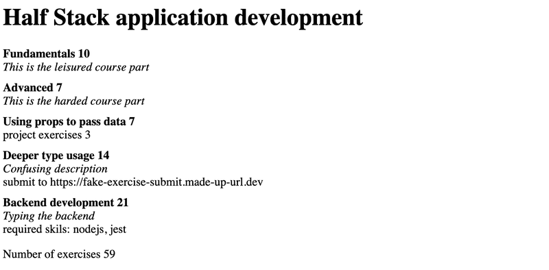

# Exercises

## Exercises 9.1.-9.7 : [initial-steps](https://github.com/jokerinya/fsopen-part9/tree/main/initial-steps)

## Exercises 9.8.-9.13 : [patientor](https://github.com/jokerinya/fsopen-part9/tree/main/patientor)

## Exercise 9.14

Create a new Create React App with TypeScript, and set up eslint for the project similarly to how we just did.

This exercise is similar to the one you have already done in [Part 1](https://fullstackopen.com/en/part1/java_script#exercises-1-3-1-5) of the course, but with TypeScript and some extra tweaks. Start off by modifying the contents of _index.tsx_ to the following:

```ts
import React from "react";
import ReactDOM from "react-dom/client";
import App from "./App";

ReactDOM.createRoot(document.getElementById("root") as HTMLElement).render(<App />);
```

and App.tsx to the following:

```tsx
const App = () => {
  const courseName = "Half Stack application development";
  const courseParts = [
    {
      name: "Fundamentals",
      exerciseCount: 10,
    },
    {
      name: "Using props to pass data",
      exerciseCount: 7,
    },
    {
      name: "Deeper type usage",
      exerciseCount: 14,
    },
  ];

  return (
    <div>
      <h1>{courseName}</h1>
      <p>
        {courseParts[0].name} {courseParts[0].exerciseCount}
      </p>
      <p>
        {courseParts[1].name} {courseParts[1].exerciseCount}
      </p>
      <p>
        {courseParts[2].name} {courseParts[2].exerciseCount}
      </p>
      <p>
        Number of exercises {courseParts.reduce((carry, part) => carry + part.exerciseCount, 0)}
      </p>
    </div>
  );
};

export default App;
```

and remove the unnecessary files.

The whole app is now in one component. That is not what we want, so refactor the code so that it consists of three components: _Header_, _Content_ and _Total_. All data is still kept in the _App_ component, which passes all necessary data to each component as props. _Be sure to add type declarations for each component's props!_

The _Header_ component should take care of rendering the name of the course. _Content_ should render the names of the different parts and the amount of exercises in each part, and _Total_ should render the total sum of exercises in all parts.

The _App_ component should look somewhat like this:

```tsx
const App = () => {
  // const-declarations

  return (
    <div>
      <Header name={courseName} />
      <Content ... />
      <Total ... />
    </div>
  )
};
```

## Exercise 9.15.

Let us now continue extending the app created in exercise 9.14. First, add the type information and replace the variable _courseParts_ with the one from the example below.

```ts
// new types
interface CoursePartBase {
  name: string;
  exerciseCount: number;
  type: string;
}

interface CourseNormalPart extends CoursePartBase {
  type: "normal";
  description: string;
}

interface CourseProjectPart extends CoursePartBase {
  type: "groupProject";
  groupProjectCount: number;
}

interface CourseSubmissionPart extends CoursePartBase {
  type: "submission";
  description: string;
  exerciseSubmissionLink: string;
}

type CoursePart = CourseNormalPart | CourseProjectPart | CourseSubmissionPart;

// this is the new coursePart variable
const courseParts: CoursePart[] = [
  {
    name: "Fundamentals",
    exerciseCount: 10,
    description: "This is the easy course part",
    type: "normal",
  },
  {
    name: "Advanced",
    exerciseCount: 7,
    description: "This is the hard course part",
    type: "normal",
  },
  {
    name: "Using props to pass data",
    exerciseCount: 7,
    groupProjectCount: 3,
    type: "groupProject",
  },
  {
    name: "Deeper type usage",
    exerciseCount: 14,
    description: "Confusing description",
    exerciseSubmissionLink: "https://fake-exercise-submit.made-up-url.dev",
    type: "submission",
  },
];
```

Now we know that both interfaces _CourseNormalPart_ and _CourseSubmissionPart_ share not only the base attributes, but also an attribute called _description_, which is a string in both interfaces.

Your first task is to declare a new interface that includes the _description_ attribute and extends the _CoursePartBase_ interface. Then modify the code so that you can remove the _description_ attribute from both _CourseNormalPart_ and _CourseSubmissionPart_ without getting any errors.

Then create a component _Part_ that renders all attributes of each type of course part. Use a switch case-based exhaustive type checking! Use the new component in component _Content_.

Lastly, add another course part interface with the following attributes: _name_, _exerciseCount_, _description_ and _requirements_, the latter being a string array. The objects of this type look like the following:

```js
{
  name: "Backend development",
  exerciseCount: 21,
  description: "Typing the backend",
  requirements: ["nodejs", "jest"],
  type: "special"
}
```

Then add that interface to the type union _CoursePart_ and add corresponding data to the _courseParts_ variable. Now, if you have not modified your _Content_ component correctly, you should get an error, because you have not yet added support for the fourth course part type. Do the necessary changes to _Content_, so that all attributes for the new course part also get rendered and that the compiler doesn't produce any errors.

The end result might look like the following:


