# Exercises

## Exercises 9.1.-9.7 : [initial-steps](https://github.com/jokerinya/fsopen-part9/tree/main/initial-steps)

> ## Exercises 9.8.-9.9.

**Before you start the exercises**

For this set of exercises you will be developing a backend for an existing project called **Patientor**, which is a simple medical record application for doctors who handle diagnoses and basic health information of their patients.

The [frontend](https://github.com/fullstack-hy2020/patientor) has already been built by outsider experts and your task is to create a backend to support the existing code.

## 9.8: Patientor backend, step1

Initialise a new backend project that will work with the frontend. Configure eslint and tsconfig with the same configurations as proposed in the material. Define an endpoint that answers to HTTP GET requests to route **/api/ping**.

The project should be runnable with npm scripts, both in development mode and, as compiled code, in production mode.

## 9.9: Patientor backend, step2

Fork and clone the project [patientor](https://github.com/fullstack-hy2020/patientor). Start the project with the help of the README file.

You can run this command if you get error message when trying to start the frontend:

```bash
npm update chokidar
```

You should be able to use the frontend without a functioning backend.

Ensure that backend answers to the ping request that _frontend_ has made on startup. Check developer tool to make sure it really works:

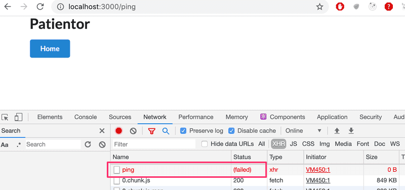

You might also want to have a look at the console tab. If something fails, [part 3](https://fullstackopen.com/en/part3) of the course shows how the problem can be solved.

> ## Exercises 9.10.-9.11.

Similarly to Ilari's flight service, we do not use a real database in our app but instead use hardcoded data that is in the files [diagnoses.json](https://github.com/fullstack-hy2020/misc/blob/master/diagnoses.json) and [patients.json](https://github.com/fullstack-hy2020/misc/blob/master/patients.json). Get the files and store those in a directory called data in your project. All data modification can be done in runtime memory, so during this part it is _not necessary to write to a file._

## 9.10: Patientor backend, step3

Create a type Diagnose and use it to create endpoint _/api/diagnoses_ for fetching all diagnoses with HTTP GET.

Structure your code properly by using meaningfully-named directories and files.

**Note** that diagnoses may or may not contain the field _latin_. You might want to use [optional properties](https://www.typescriptlang.org/docs/handbook/interfaces.html#optional-properties) in the type definition.

## 9.11: Patientor backend, step4

Create data type _Patient_ and set up the GET endpoint _/api/patients_ which returns all patients to the frontend, excluding field _ssn_. Use a [utility type](https://www.typescriptlang.org/docs/handbook/utility-types.html) to make sure you are selecting and returning only the wanted fields.

In this exercise, you may assume that field _gender_ has type _string_.

Try the endpoint with your browser and ensure that _ssn_ is not included in the response:

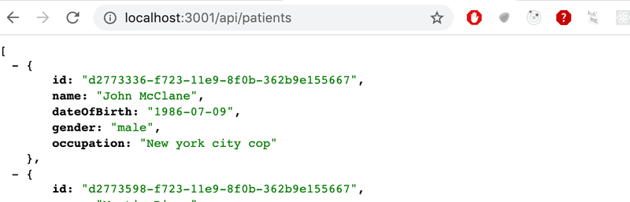

After creating the endpoint, ensure that the _frontend_ shows the list of patients:

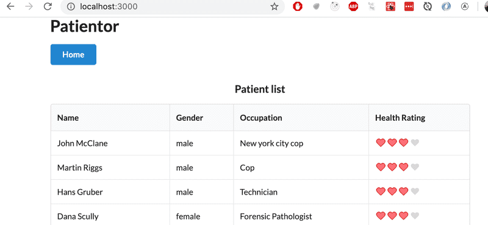

> ## Exercises 9.12.-9.13.

## 9.12: Patientor backend, step5

Create a POST endpoint _/api/patients_ for adding patients. Ensure that you can add patients also from the frontend. You can create unique ids of type string using the uuid library:

```js
import { v1 as uuid } from 'uuid';
const id = uuid();
```

## 9.13: Patientor backend, step6

Set up safe parsing, validation and type guards to the POST _/api/patients_ request.

Refactor the gender field to use an [enum type](https://www.typescriptlang.org/docs/handbook/enums.html).

## Exercises 9.14.-9.15 : [courseinfo](https://github.com/jokerinya/fsopen-part9/tree/main/courseinfo)

> ## Exercises 9.16.-9.18.

We will soon add a new type for our app, _Entry_, which represents a lightweight patient journal entry. It consists of a journal text, i.e. a _description_, a creation date, information regarding the specialist who created it and possible diagnosis codes. Diagnosis codes map to the ICD-10 codes returned from the _/api/diagnoses_ endpoint. Our naive implementation will be that a patient has an array of entries.

Before going into this, let us do some preparatory work.

## 9.16: patientor, step1

Create an endpoint _/api/patients/:id_ that returns all of the patient information for one patient, including the array of patient entries that is still empty for all the patients. For the time being, expand the backend types as follows:

```ts
// eslint-disable-next-line @typescript-eslint/no-empty-interface
export interface Entry {}

export interface Patient {
    id: string;
    name: string;
    ssn: string;
    occupation: string;
    gender: Gender;
    dateOfBirth: string;
    entries: Entry[];
}

export type PublicPatient = Omit<Patient, 'ssn' | 'entries'>;
```

The response should look as follows:

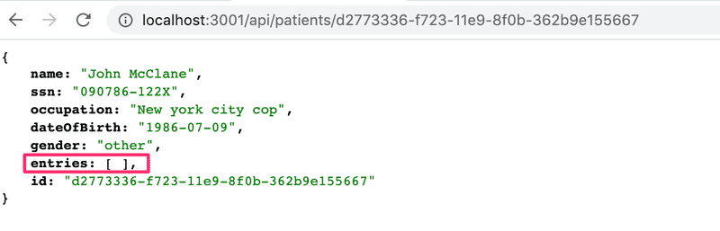

## 9.17: patientor, step2

Create a page for showing a patient's full information in the frontend.

The user should be able to access a patient's information by clicking the patient's name.

Fetch the data from the endpoint created in the previous exercise. After fetching the patient information from the backend, add the fetched information to the application's state. Do not fetch the information if it already is in the app state (i.e. if the user is visiting the same patient's information many times).

Since we now have the state in the context, you'll need to define a new action type for updating an individual patient's data.

The Application uses [MaterialUI](https://mui.com/core/) that we covered in [part 7](https://fullstackopen.com/en/part7/more_about_styles) for styling. You may also use it for the new components but that is up to you since our main focus now is TypeScript.

The Application also uses [React Router](https://reactrouter.com/en/main/start/tutorial) to control which view is visible in the frontend. You might want to have a look at [part 7]https://fullstackopen.com/en/part7/react_router) if you don't yet have a grasp on how the router works.

The result could look like this:

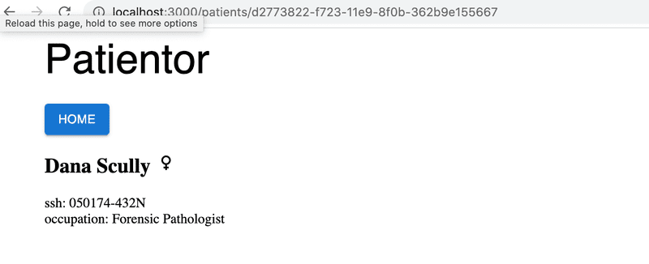

Example uses [Material UI Icons](https://mui.com/material-ui/material-icons/) to represent genders.

**Note** that in order to access the id in the url, you need to give [useParams](https://reactrouter.com/en/main/hooks/use-params) a proper type argument:

```jsx
const { id } = useParams<{ id: string }>();
```

## 9.18: patientor, step3

Currently, we create _action_ objects wherever we dispatch actions, e.g. the _App_ component has the following:

```js
dispatch({
    type: 'SET_PATIENT_LIST',
    payload: patientListFromApi,
});
```

Define [action creator](https://fullstackopen.com/en/part6/flux_architecture_and_redux#action-creators) functions in the file _src/state/reducer.ts_ and refactor the code to use them.

For example, the _App_ should become like the following:

```js
import { useStateValue, setPatientList } from './state';

// ...

dispatch(setPatientList(patientListFromApi));
```

## 9.19: patientor, step4

Define the types _OccupationalHealthcareEntry_ and _HospitalEntry_ so that those conform with the example data. Ensure that your backend returns the entries properly when you go to an individual patient's route:

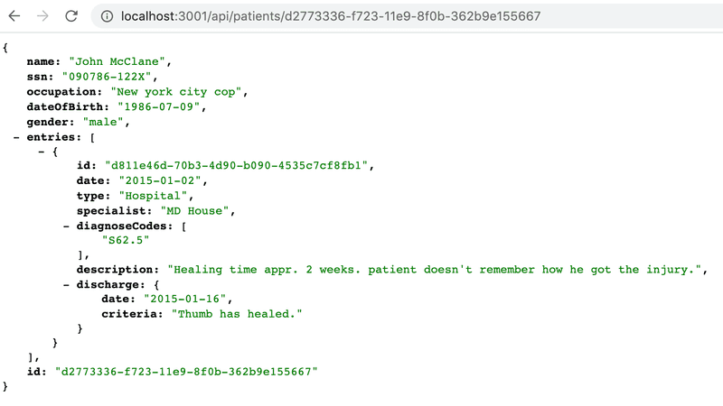

Use types properly in the backend! For now, there is no need to do a proper validation for all the fields of the entries in the backend, it is enough e.g. to check that the field _type_ has a correct value.

## 9.20: patientor, step5

Extend a patient's page in the frontend to list the _date_, _description_ and _diagnose codes_ of the patient's entries.

You can use the same type definition for an _Entry_ in the frontend. For these exercises, it is enough to just copy/paste the definitions from the backend to the frontend.

Your solution could look like this:

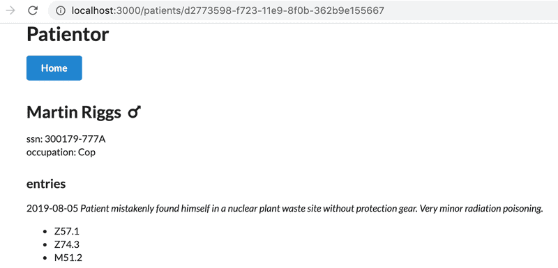

## 9.21: patientor, step6

Fetch and add diagnoses to the application state from the _/api/diagnoses_ endpoint. Use the new diagnosis data to show the descriptions for patient's diagnosis codes:

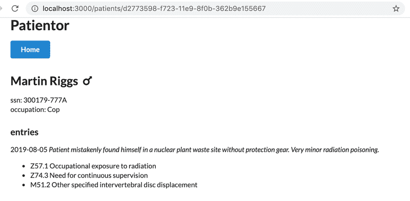

## 9.22: patientor, step7

Extend the entry listing in the patient's page to include the Entry's details with a new component that shows the rest of the information of the patient's entries distinguishing different types from each other.

You could use eg. [Icon](https://mui.com/material-ui/material-icons/) or some other [Material UI](https://mui.com/) component to get appropriate visuals for your listing.

You should use a `switch case-based` rendering and _exhaustive type checking_ so that no cases can be forgotten.

Like this:

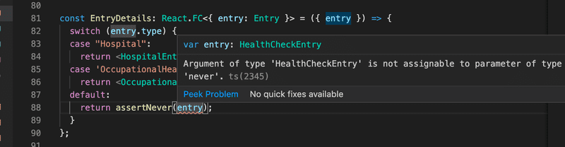

The resulting entries in the listing could look something like this:

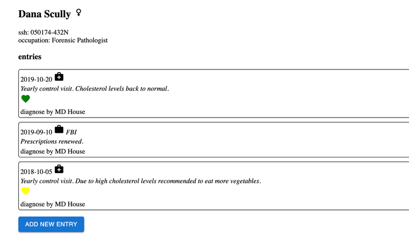

## 9.23: patientor, step8

We have established that patients can have different kinds of entries. We don't yet have any way of adding entries to patients in our app, so, at the moment, it is pretty useless as an electronic medical record.

Your next task is to add endpoint _/api/patients/:id/entries_ to your backend, through which you can POST an entry for a patient.

Remember that we have different kinds of entries in our app, so our backend should support all those types and check that at least all required fields are given for each type.

## 9.24: patientor, step9

Now that our backend supports adding entries, we want to add the corresponding functionality to the frontend. In this exercise, you should add a form for adding an entry to a patient. An intuitive place for accessing the form would be on a patient's page.

In this exercise, it is enough to **support _one_ entry type**, and you do not have to handle any errors. It is enough if a new entry can be created when the form is filled with valid data.

Upon a successful submit, the new entry should be added to the correct patient and the patient's entries on the patient page should be updated to contain the new entry.

If you like, you can re-use some of the code from the Add patient form for this exercise, but this is not a requirement.

Note that the file [FormField.tsx](https://github.com/fullstack-hy2020/patientor/blob/main/src/AddPatientModal/FormField.tsx#L58) has a ready-made component called DiagnosisSelection that can be used for setting the field diagnoses.

It can be used as follows:

```tsx
const AddEntryForm = ({ onSubmit, onCancel }: Props) => {
    const [{ diagnoses }] = useStateValue();

    return (
        <Formik
            initialValues={
                {
                    /// ...
                }
            }
            onSubmit={onSubmit}
            validate={(values) => {
                /// ...
            }}
        >
            {({ isValid, dirty, setFieldValue, setFieldTouched }) => {
                return (
                    <Form className='form ui'>
                        // ...
                        <DiagnosisSelection
                            setFieldValue={setFieldValue}
                            setFieldTouched={setFieldTouched}
                            diagnoses={Object.values(diagnoses)}
                        />
                        // ...
                    </Form>
                );
            }}
        </Formik>
    );
};
```

With small tweaks on types, the readily made component _SelectField_ can be used for the heath check rating.

## 9.25: patientor, step10

Extend your solution so that it displays an error message if some required values are missing or formatted incorrectly.

## 9.26: patientor, step11

Extend your solution so that it supports two entry types and displays an error message if some required values are missing or formatted incorrectly. You do not need to care about the possible errors in the server's response.

The easiest but surely not the most elegant way to do this exercise is to have a separate form for each different entry type. Getting the types to work properly might be a slight challenge if you use just a single form.

Note that that if you need alter the shown form based on user selections, you can access the form values using the parameter values of the rendering function:

```tsx
<Formik initialValues={} onSubmit={onSubmit} validate={}>
    {({ isValid, dirty, setFieldValue, setFieldTouched, values }) => {
        console.log(values);
        return <Form className='form ui'></Form>;
    }}
</Formik>
```

## 9.27: patientor, step12

Extend your solution so that it supports _all the entry types_ and displays an error message if some required values are missing or formatted incorrectly. You do not need to care about the possible errors in the server's response.

# Submitting exercises and getting the credits

Exercises of this part are submitted via [the submissions system](https://studies.cs.helsinki.fi/stats/courses/fs-typescript) just like in the previous parts, but unlike previous parts, the submission goes to a different "course instance". Remember that you have to finish at least 24 exercises to pass this part!

Once you have completed the exercises and want to get the credits, let us know through the exercise submission system that you have completed the course:

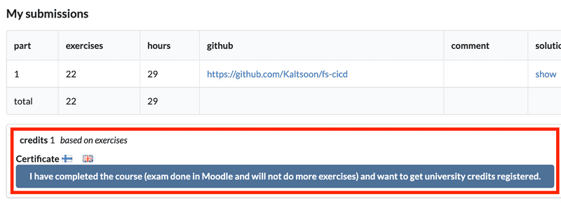

**Note** that you need a registration to the corresponding course part for getting the credits registered, see [here](https://fullstackopen.com/en/part0/general_info#parts-and-completion) for more information.

You can download the certificate for completing this part by clicking one of the flag icons. The flag icon corresponds to the certificate's language.
